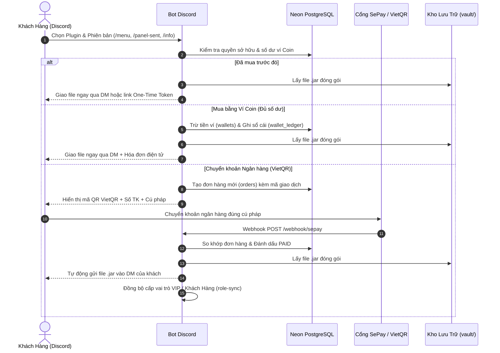

# Kho Plugin v2.0 — Discord Bot & Admin Web Dashboard

Hệ thống quản lý, phân phối và sao lưu plugin Minecraft tự động hóa, được thiết kế tách biệt hoàn toàn giữa **Bot Discord** và **Admin Web Dashboard**, sử dụng cơ sở dữ liệu dùng chung **Neon.tech Serverless PostgreSQL** qua **Drizzle ORM**.

---

## 🏛️ Kiến trúc Hệ thống v2.0 (Microservices Monorepo)

```
                           ┌────────────────────────┐
                           │   Neon.tech Postgres   │
                           │   (Serverless Cloud)   │
                           └───────────┬────────────┘
                                       │
                    ┌──────────────────┴──────────────────┐
                    ▼                                     ▼
        ┌──────────────────────┐              ┌──────────────────────┐
        │   discord/ (Bot)     │              │  dashboard/ (Web)    │
        ├──────────────────────┤              ├──────────────────────┤
        │ • Discord.js Bot     │              │ • Fastify Stateless  │
        │ • CloakBrowser C++   │              │ • React 19 Frontend  │
        │ • Turnstile Clicker  │              │ • Neumorphic 2.0 UI  │
        │ • SePay Webhook      │              │ • Cookie HMAC Auth   │
        │ • VIP Role Auto-Sync │              │ • Zero SQLite Local  │
        └──────────────────────┘              └──────────────────────┘
```

1. **`discord/`** ([Xem Chi Tiết Cơ Chế Hoạt Động](file:///e:/Codebase/Plugins%20Vault%20v2.0/discord/README.md)):
   - Chạy Bot Discord thế hệ mới với giao diện **Discord Components V2** và đồ họa **Canvas Shelf/Banner**.
   - Bộ 6 Slash Commands tinh gọn: `/menu`, `/panel-sent`, `/info`, `/find`, `/report`, `/setup` (quản trị kênh & nhân sự).
   - Hệ thống **Kênh Động (`discord_channels`)** với bộ nhớ đệm RAM Cache (TTL 60s) và cơ chế Fallback 3 lớp.
   - Hệ thống **Phân Quyền Staffs (`staffs`, `audit_logs`)** độc lập bảo mật (Decoupled Authentication Architecture, Zero Credential Leakage).
   - Engine **CloakBrowser Stealth Chromium** với 87 C++ patches, humanize Bézier curve mouse, tự động giả lập click vượt Cloudflare Turnstile / Managed Challenge trên SpigotMC.
   - Xử lý Webhook SePay VietQR tự động giao file qua DM/One-time Token và đồng bộ cấp Role VIP / Khách Hàng.
2. **`dashboard/`**:
   - Duy nhất **1 trang Admin Dashboard**, bảo mật tối đa, không chứa bất kỳ trang web public nào.
   - **Stateless 100%**: Không chứa SQLite hay file dữ liệu cục bộ, toàn bộ query thực thi trực tiếp lên Neon.tech qua Drizzle ORM.
   - Giao diện Neumorphic / Glassmorphism 2.0 cao cấp, hỗ trợ Dark/Light mode, biểu đồ doanh thu, quản lý tài khoản Spigot, quản lý ví và mã giảm giá.
3. **`packages/db/`**:
   - Gói thư viện database dùng chung nội bộ monorepo (`@vault/db`).
   - Schema chuẩn 3NF (18 bảng PostgreSQL trên Neon.tech, snake_case, strict foreign keys và indexes).
4. **`old/`**:
   - Thư mục lưu trữ mã nguồn và schema SQLite của phiên bản cũ để làm tư liệu đối chiếu.

---

## 🛒 3. Quy Trình Mua Hàng & Giao Nhận File (Transaction & Delivery)



### Phương Thức Giao Nhận File Thông Minh:
1. **Giao trực tiếp qua DM**: Bot tự động đính kèm file `.jar` gửi vào tin nhắn riêng của khách hàng.
2. **Fallback One-Time Token URL**: Nếu file vượt quá giới hạn 25MB của Discord hoặc khách hàng chặn tin nhắn từ người lạ, Bot tự động tạo một liên kết tải bảo mật dùng một lần (có thời hạn 15–30 phút) thông qua Fastify Server.

---

## 💳 4. Quy Trình Nạp Tiền & Tự Động Thăng Hạng VIP

1. **Nạp Tiền Qua Chuyển Khoản Ngân Hàng (SePay VietQR)**:
   - Khách hàng mở Modal nhập số tiền cần nạp.
   - Bot tạo mã QR VietQR tương ứng. Khi nhận Webhook ngân hàng, tiền được cộng thẳng vào bảng `wallets` và lưu lịch sử biến động trong `wallet_ledger`.
2. **Nạp Thẻ Cào Điện Thoại (Card2k)**:
   - Khách chọn nhà mạng (Viettel, Vina, Mobi...) và mệnh giá -> Nhập mã thẻ & serial.
   - Hệ thống chuyển tiếp yêu cầu đến đối tác gạch thẻ Card2k và phản hồi kết quả duyệt thẻ.
3. **Cơ Chế Tự Động Cấp Vai Trò (Role Sync)**:
   - Dịch vụ `role-sync.ts` tự động tính tổng chi tiêu tích lũy của từng người dùng.
   - Ngay khi đạt các hạn mức cấu hình, Bot tự động cấp role `Khách Hàng`, `VIP`, `Đại Gia` trên Discord Server mà không cần admin duyệt thủ công.

---

## 💻 5. Cơ Chế Hoạt Động Của Admin Web Dashboard (`dashboard/`)

Dashboard là trung tâm kiểm soát toàn diện dành riêng cho Ban Quản Trị:

- **Kiến Trúc Stateless 100%**: Web Server Fastify và ứng dụng React 19 không lưu bất kỳ dữ liệu nhạy cảm nào tại đĩa cứng cục bộ. Toàn bộ thao tác đều được truy vấn thời gian thực từ Neon PostgreSQL.
- **Xác Thực Timing-Safe**: Cơ chế bảo vệ Cookie HMAC và mật khẩu với thuật toán `crypto.timingSafeEqual`, ngăn chặn tuyệt đối các cuộc tấn công dò thời gian (Timing Attacks).
- **Các Phân Hệ Quản Trị**:
  - **Quản lý Kho Plugin**: Thêm, sửa, xóa, đặt giá cọc, upload file `.jar` thủ công hoặc kích hoạt tự động quét.
  - **Quản lý Tài Khoản Spigot**: Theo dõi trạng thái tài khoản marketplace, kiểm tra hạn cookie và giám sát tiến trình tải.
  - **Đối Soát Tài Chính & Thống Kê**: Biểu đồ doanh thu theo ngày/tháng, nhật ký dòng tiền, quản lý mã giảm giá (Discount Codes).

---

## 🕷️ 6. Cơ Chế Thu Thập & Tải Tự Động SpigotMC (CloakBrowser Stealth Engine)

Hệ thống sở hữu cơ chế cập nhật tự động độc quyền giúp kho plugin luôn duy trì phiên bản mới nhất:

```
┌────────────────────────────────┐       Quét bản mới định kỳ       ┌────────────────────────┐
│  Maintenance Scheduler Worker  │ ────────────────────────────────► │  SpigotMC Marketplace  │
└───────────────┬────────────────┘                                   └───────────┬────────────┘
                │                                                                │
                ▼                                                                ▼
┌────────────────────────────────┐     Vượt qua Cloudflare Challenge ┌────────────────────────┐
│  CloakBrowser Stealth Chromium │ ◄──────────────────────────────── │ Cloudflare Turnstile / │
│  • 87 bản vá C++ chống bot     │    Humanized Bézier Mouse Cursor  │ Managed Challenge      │
│  • Quản lý Cookie XenForo      │                                   └────────────────────────┘
└───────────────┬────────────────┘
                │
                ▼ Tự động tải file .jar mới
┌────────────────────────────────┐
│   Kho Lưu Trữ Đĩa Cục Bộ       │ ──── Cập nhật bản ghi ────► Neon PostgreSQL
│   Thư mục vault/ (Chmod 0o750) │                             (Bảng versions)
└────────────────────────────────┘
```

1. **Lập Lịch Tự Động (Maintenance Scheduler)**: Định kỳ kiểm tra danh sách tài nguyên đã mua trên SpigotMC.
2. **CloakBrowser Stealth Engine**:
   - Sử dụng Chromium đặc biệt được áp dụng 87 bản vá C++ nhằm loại bỏ toàn bộ dấu hiệu tự động hóa (webdriver flags).
   - Tự động di chuyển chuột theo đường cong **Bézier Curves** ngẫu nhiên giống hệt hành vi người thật để vượt qua **Cloudflare Turnstile** mà không bị chặn IP.
3. **Mã Hóa Dữ Liệu Phiên**: Thông tin đăng nhập SpigotMC và Cookie XenForo được mã hóa bằng thuật toán **AES-256-GCM** trước khi lưu vào cơ sở dữ liệu.

---

## 🛡️ 7. Tiêu Chuẩn Bảo Mật & An Toàn Dữ Liệu

- **Nguyên Tắc Zero Credential Leakage**: Mật khẩu của tài khoản quản trị và khách hàng tuyệt đối không lưu trong database lõi của kho plugin.
- **Bảo Vệ Thư Mục Kho (Filesystem Isolation)**: Thư mục `vault/` và `tmp/` được phân quyền nghiêm ngặt `0o750`, chỉ cho phép tiến trình bot đọc/ghi.
- **Toàn Vẹn Dữ Liệu Sổ Cái (Audit Trail)**: Mọi biến động số dư và thao tác cấu hình hệ thống đều được lưu vết vĩnh viễn trong `wallet_ledger` và `audit_logs`.
- **Timing-Safe Auth**: Mọi so sánh password và HMAC cookie đều sử dụng `crypto.timingSafeEqual` chống tấn công side-channel / timing attack.
