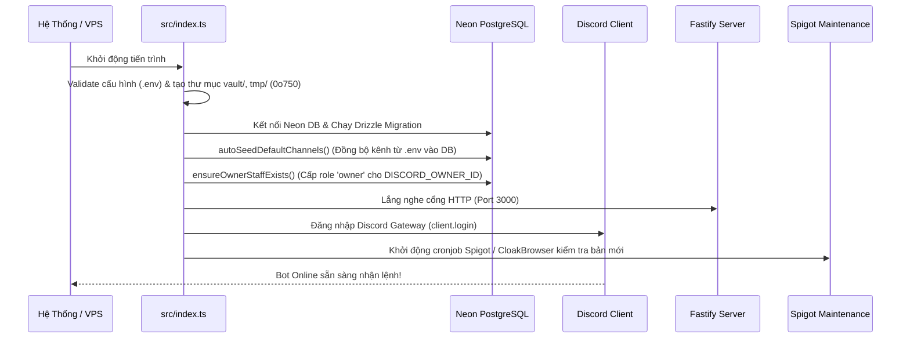
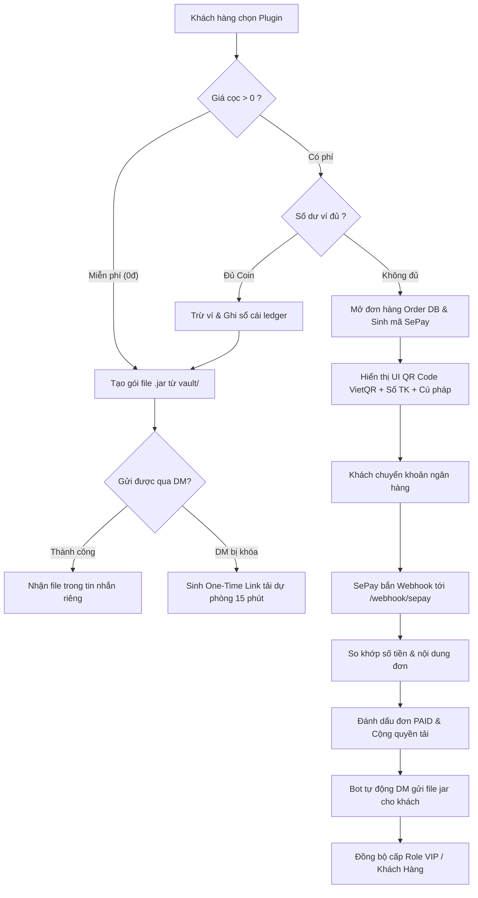

# 🤖 EZStore Discord Bot — Hướng Dẫn Kiến Trúc & Cơ Chế Hoạt Động (v2.0)

> **Dự án**: EZStore Plugins Vault v2.0  
> **Gói**: `discord/` (`plugin-vault-bot`)  
> **Ngôn ngữ**: TypeScript / Node.js (>= 24)  
> **Thư viện chính**: `discord.js v14`, `drizzle-orm`, `@neondatabase/serverless`, `@napi-rs/canvas`, `fastify`  
> **Cơ sở dữ liệu**: Neon PostgreSQL Cloud (`@vault/db`) kết hợp SQLite cục bộ  

---

## 📑 Mục Lục
1. [Tổng Quan Hệ Thống](#-1-tổng-quan-hệ-thống)
2. [Sơ Đồ Kiến Trúc Hoạt Động](#-2-sơ-đồ-kiến-trúc-hoạt-động)
3. [Vòng Đời Khởi Động (Boot Pipeline)](#-3-vòng-đời-khởi-động-boot-pipeline)
4. [Hệ Thống Kênh Động (Dynamic Channels)](#-4-hệ-thống-kênh-động-dynamic-channels)
5. [Hệ Thống Phân Quyền Staffs & Decoupled RBAC](#-5-hệ-thống-phân-quyền-staffs--decoupled-rbac)
6. [Chi Tiết 6 Slash Commands Cốt Lõi](#-6-chi-tiết-6-slash-commands-cốt-lõi)
7. [Quy Trình Mua Hàng & Giao Nhận File (Purchase & Delivery Flow)](#-7-quy-trình-mua-hàng--giao-nhận-file-purchase--delivery-flow)
8. [Quy Trình Nạp Tiền & Tự Động Thăng Hạng VIP](#-8-quy-trình-nạp-tiền--tự-động-thăng-hạng-vip)
9. [Worker Tải Tự Động SpigotMC & CloakBrowser](#-9-worker-tải-tự-động-spigotmc--cloakbrowser)
10. [Bảng Biến Môi Trường (.env) & Vận Hành](#-10-bảng-biến-môi-trường-env--vận-hành)

---

## 🌟 1. Tổng Quan Hệ Thống

Bot Discord là **cửa ngõ giao tiếp trực tiếp (Front-facing Gateway)** của hệ thống EZStore Plugins Vault v2.0 với người dùng và ban quản trị. Bot cho phép:
- Khách hàng xem danh mục plugin Minecraft qua giao diện đồ họa **Discord Components V2** và **Canvas Shelf/Banner**.
- Tìm kiếm tức thì qua **Modal Dialog** hoặc **Autocomplete**.
- Mua plugin bằng số dư Ví Coin hoặc quét mã QR ngân hàng (VietQR qua SePay).
- Nhận file plugin `.jar` ngay trong tin nhắn riêng (DM) hoặc link tải dự phòng có thời hạn (One-Time Token).
- Tự động tích lũy nạp tiền và cấp vai trò (Role VIP / Khách Hàng) trên Discord Server.
- Ban Quản Trị cấu hình kênh động (`/setup channel`) và phân quyền nhân sự (`/setup staff`) trực tiếp trên Discord mà **không cần restart bot hay sửa file cấu hình VPS**.

---

## 🏗️ 2. Sơ Đồ Kiến Trúc Hoạt Động

```
                              ┌──────────────────────────────────┐
                              │        DISCORD GATEWAY API       │
                              │ (Slash Commands, Buttons, Modals)│
                              └─────────────────┬────────────────┘
                                                │
                                                ▼
┌────────────────────────────────────────────────────────────────────────────────────────┐
│                                 TIẾN TRÌNH BOT DISCORD                                 │
│                                                                                        │
│  ┌─────────────────────────┐   ┌──────────────────────────┐   ┌─────────────────────┐  │
│  │   Discord Bot Client    │   │      Router & Guards     │   │   Canvas Renderer   │  │
│  │   • Slash Command Router│◄──┤  • requireAdminRole      ├──►│   • Skia Canvas 2D  │  │
│  │   • ModalSubmit Handler │   │  • In-Memory Cache (60s) │   │   • Dynamic Banner  │  │
│  │   • SelectMenu Handler  │   │  • Fallback 3 lớp        │   │   • Shelf Display   │  │
│  └───────────┬─────────────┘   └──────────────┬───────────┘   └─────────────────────┘  │
│              │                                │                                        │
│              ▼                                ▼                                        │
│  ┌─────────────────────────┐   ┌──────────────────────────┐   ┌─────────────────────┐  │
│  │  Services & Repositories│   │  Fastify HTTP Server     │   │ CloakBrowser Engine │  │
│  │  • channel-manager.ts   │   │  • Port 3000 (Internal)  │   │ • Stealth Chromium  │  │
│  │  • neon-staffs.ts       │   │  • /webhook/sepay        │   │ • Turnstile Clicker │  │
│  │  • neon-plugins.ts      │   │  • /download/:token      │   │ • XenForo Session   │  │
│  │  • match-and-fulfil.ts  │   │  • Deliver via DM token  │   │ • Auto Jar Crawler  │  │
│  └───────────┬─────────────┘   └──────────────┬───────────┘   └──────────┬──────────┘  │
└──────────────┼────────────────────────────────┼──────────────────────────┼─────────────┘
               │                                │                          │
               ▼                                ▼                          ▼
┌────────────────────────────┐    ┌──────────────────────────┐    ┌──────────────────────┐
│  Neon Serverless Postgres  │    │      Cổng Thanh Toán     │    │  SpigotMC Marketplace│
│  (18 Tables: plugins,      │    │  • SePay Webhook (QR)    │    │  (Tự động kiểm tra   │
│   versions, discord_       │    │  • Card2k (Thẻ cào)      │    │   bản mới & download │
│   channels, staffs, etc.)  │    │  • Ngân hàng VietQR      │    │   vào thư mục vault/)│
└────────────────────────────┘    └──────────────────────────┘    └──────────────────────┘
```

---

## ⚡ 3. Vòng Đời Khởi Động (Boot Pipeline)

Khi chạy lệnh khởi động (`pnpm dev` hoặc `pnpm start` tại [src/index.ts](file:///e:/Codebase/Plugins%20Vault%20v2.0/discord/src/index.ts)), tiến trình thực thi tuần tự theo 7 bước nghiêm ngặt:



1. **Khởi tạo thư mục bảo mật**: Tạo `vault/` (lưu file jar) và `tmp/` với quyền `0o750` chống truy cập trái phép.
2. **Khởi tạo Cơ sở dữ liệu Neon**: Kết nối Neon PostgreSQL qua pooler SSL.
3. **Tự động Seed Kênh Mặc Định (`autoSeedDefaultChannels`)**: Nếu bảng `discord_channels` chưa có dữ liệu, bot tự động đọc `DISCORD_NOTIFY_CHANNEL_ID` từ `.env` nạp vào database.
4. **Tự động Khởi Tạo Chủ Sở Hữu (`ensureOwnerStaffExists`)**: Cấp quyền `owner` với `permissions: ['*']` cho tài khoản `DISCORD_OWNER_ID`.
5. **Dọn dẹp File Tạm Mồ Côi (`sweepOrphanedTemps`)**: Xóa các file jar tạm thời bị đứt gãy từ lần chạy trước.
6. **Khởi động Fastify HTTP Server**: Phục vụ tiếp nhận Webhook ngân hàng SePay và link download file jar.
7. **Đăng nhập Discord Client & Bật Scheduler Bảo trì**: Duy trì kết nối WebSocket Gateway và lập lịch kiểm tra update SpigotMC.

---

## 📡 4. Hệ Thống Kênh Động (Dynamic Channels)

Thay vì cố định ID kênh trong file `.env`, hệ thống chuyển toàn bộ cấu hình kênh về cơ sở dữ liệu `discord_channels`.

### Bảng Mục Đích Kênh (Purpose):
| Purpose | Mô Tả | Hành Vi Mặc Định |
|---|---|---|
| `notify` | Kênh nhận báo cáo sự cố & lỗi bot | Nhận thông báo từ lệnh `/report` |
| `orders` | Kênh thông báo đơn hàng mới | Bắn log khi có khách nạp tiền/mua plugin thành công |
| `audit` | Kênh nhật ký kiểm toán quản trị | Bắn log khi Staff thêm/xóa nhân sự, đổi kênh |
| `panel` | Kênh chỉ định gửi Bảng điều khiển mua hàng | Kênh mặc định để đặt UI `/panel-sent` |

### Cơ chế Fallback 3 Lớp & In-Memory Caching (0ms Latency):
- **Lớp 1 (RAM Cache)**: Lưu trong bộ nhớ tiến trình với **TTL 60 giây**. Mọi tin nhắn gửi thông báo đều đọc từ RAM, không gây nghẽn mạng hay trễ kết nối Neon DB.
- **Lớp 2 (Database Neon)**: Khi hết hạn TTL hoặc sau khi lệnh `/setup channel set` được gọi, cache lập tức bị vô hiệu hóa (Invalidate) và truy vấn lại DB.
- **Lớp 3 (Fallback .env)**: Nếu Database chưa có bản ghi, bot tự động dùng biến môi trường `DISCORD_NOTIFY_CHANNEL_ID`.

---

## 🛡️ 5. Hệ Thống Phân Quyền Staffs & Decoupled RBAC

Hệ thống sử dụng bảng `staffs` làm **Single Source of Truth** cho cả Discord Bot và Web Dashboard theo mô hình **Decoupled Authentication Architecture**.

### Cấu Trúc Bảng `staffs`:
- `email`: Khóa ngoại logic liên kết với cơ sở dữ liệu xác thực của Web Dashboard.
- `dashboard_user_id`: UUID tài khoản Dashboard.
- `discord_user_id`: Snowflake ID trên Discord của Staff.
- `role`: Phân cấp vai trò:
  - `owner`: Toàn quyền tối cao (`*`).
  - `admin`: Quản lý cấu hình kênh, giá plugin, duyệt jar, quản lý staff cấp dưới.
  - `moderator`: Quản lý plugin, upload file jar.
  - `support`: Hỗ trợ khách hàng, xem báo cáo lỗi.
- `permissions`: Danh sách quyền cụ thể dạng mảng `text[]` (`plugins.manage`, `channels.manage`, `staffs.manage`...).
- **Nguyên tắc An ninh**: Không lưu mật khẩu, session hay token trong Vault DB (**Zero Credential Leakage**).

### Kiểm tra Quyền Quản Trị Đa Tầng (`requireAdminRole`):
1. **Kiểm tra Owner ID**: Nếu `user.id === env.DISCORD_OWNER_ID` -> Cho phép ngay.
2. **Kiểm tra Discord Roles**: Nếu user sở hữu bất kỳ Role ID nào trong `ADMIN_ROLE_IDS` cấu hình -> Cho phép.
3. **Kiểm tra Neon DB Staffs**: Truy vấn bảng `staffs` theo `discord_user_id` với `is_active = true` và `role in ('owner', 'admin')` -> Cho phép.

---

## 🎯 6. Chi Tiết 6 Slash Commands Cốt Lõi

Hệ thống được tinh gọn tối đa xuống đúng 6 lệnh chuẩn, loại bỏ các lệnh trùng lặp:

### 1. `/menu [trang]`
- **Mục đích**: Mở kệ hàng danh mục plugin (Canvas Shelf) cho người dùng cá nhân.
- **Phản hồi**: `flags: MessageFlags.Ephemeral` (chỉ người gõ lệnh nhìn thấy, không làm loãng kênh chat).
- **Tính năng**:
  - Vẽ kệ hàng đồ họa bằng Skia Canvas hiển thị logo, tên, giá tiền và trạng thái plugin.
  - Phân trang qua nút bấm `[⬅️ Trang trước]` và `[Trang sau ➡️]`.
  - StringSelectMenu chọn xem chi tiết plugin.

### 2. `/panel-sent [channel]` (Chỉ dành cho Admin)
- **Mục đích**: Gửi Bảng Điều Khiển Mua Hàng cố định vào kênh công khai.
- **Cấu trúc UI**: Sử dụng chuẩn **Discord Components V2**:
  - **Header Container**: Lời chào mừng EZStore.
  - **Media Section**: Banner cửa hàng chất lượng cao.
  - **Select Menu (`panel:select_plugin`)**: Danh sách thả xuống gồm 25 plugin hàng đầu kèm số lượng phiên bản và giá tiền.
  - **Cơ chế**: Tin nhắn công khai vĩnh viễn, khi thành viên tương tác chọn plugin sẽ mở ra giao diện mua hàng riêng tư (Ephemeral).

### 3. `/info [plugin]`
- **Mục đích**: Tra cứu thông tin đầy đủ của một plugin.
- **Tham số**: `plugin` (Hỗ trợ **Autocomplete** tìm theo tên, ID, slug).
- **Giao diện**:
  - Banner đồ họa Canvas vẽ tự động gồm Icon, Tên, Giá, Đánh giá, Thống kê lượt tải.
  - Nút chuyển hướng SpigotMC gốc.
  - Nút Mua/Tải trực tiếp.

### 4. `/find`
- **Mục đích**: Tìm kiếm plugin theo từ khóa.
- **Cơ chế**: Mở ngay một **Modal Dialog**:
  - Ô nhập: `Tên, alias hoặc từ khóa plugin`.
  - Nếu chỉ tìm thấy 1 kết quả: Mở thẳng giao diện `/info` của plugin đó.
  - Nếu tìm thấy nhiều kết quả: Trả về Select Menu danh sách kết quả phù hợp để chọn.

### 5. `/report`
- **Mục đích**: Gửi báo cáo lỗi, sự cố hoặc yêu cầu hỗ trợ đến Ban Quản Trị.
- **Cơ chế**:
  - Mở **Modal Dialog** gồm 2 trường: `Tiêu đề sự cố` và `Mô tả chi tiết`.
  - Khi gửi: Bot tự động định dạng Container V2 màu đỏ (`danger`) và gửi thẳng vào kênh Admin `notify` được cấu hình trong database.

### 6. `/setup` (Chỉ dành cho Admin / Owner)
Gồm 2 nhóm lệnh con quản trị:
- **/setup channel**:
  - `set [purpose] [channel]`: Chỉ định kênh chức năng (`notify`, `orders`, `audit`, `panel`).
  - `list`: Xem danh sách tất cả các kênh đang kích hoạt trong hệ thống.
- **/setup staff**:
  - `add [@user] [role] [email]`: Cấp quyền nhân sự trực tiếp trên Discord.
  - `remove [@user]`: Gỡ quyền và khóa tài khoản nhân sự.
  - `list`: Xem danh sách ban quản trị kèm vai trò và ngày thêm.

---

## 🛒 7. Quy Trình Mua Hàng & Giao Nhận File (Purchase & Delivery Flow)



### Chi tiết các bước:
1. **Kiểm tra quyền sở hữu**: Nếu khách hàng đã mua phiên bản này trước đó, hệ thống cho phép tải lại miễn phí vĩnh viễn.
2. **Thanh toán bằng Ví Coin**: Nếu số dư trong `wallets` đủ để chi trả, hệ thống trừ coin ngay tức thì và giao hàng trong 0.5 giây.
3. **Thanh toán qua Ngân Hàng (VietQR)**:
   - Hệ thống tạo đơn hàng với mã nhận diện duy nhất (`SEPAY_CODE_PREFIX` + ký tự ngẫu nhiên).
   - Render hình ảnh mã QR chuẩn VietQR với đúng số tiền và nội dung chuyển khoản.
   - Khi tiền vào tài khoản ngân hàng, SePay gửi Webhook đến Fastify Server (`/webhook/sepay`).
   - Bot lập tức nhận dạng đơn hàng, mở khóa giao file jar và gửi thông báo cảm ơn vào DM của khách.

---

## 💳 8. Quy Trình Nạp Tiền & Tự Động Thăng Hạng VIP

Hệ thống hỗ trợ 2 phương thức nạp số dư ví:
1. **Nạp Ngân Hàng (SePay VietQR)**: Khách nhập số tiền muốn nạp qua Modal -> Quét mã QR -> Webhook tự động cộng số dư vào bảng `wallets` và lưu lịch sử biến động số dư trong `wallet_ledger`.
2. **Nạp Thẻ Cào (Card2k)**:
   - Chọn nhà mạng (Viettel, Mobifone, Vinaphone...) -> Chọn mệnh giá -> Mở Modal nhập Serial & Mã thẻ.
   - Gửi yêu cầu gạch thẻ tới API Card2k và phản hồi kết quả tức thì.

### Tự Động Đồng Bộ Role Discord (`role-sync.ts`):
- Hệ thống theo dõi **Tổng chi tiêu tích lũy** của người dùng.
- Tự động cấp các vai trò trên Discord Server tương ứng với các hạn mức:
  - **Role Khách Hàng**: Tự động cấp ngay sau đơn hàng đầu tiên.
  - **Role VIP / Đại Gia**: Tự động cấp khi tổng chi tiêu đạt các mốc cấu hình trong database/settings.

---

## 🕷️ 9. Worker Tải Tự Động SpigotMC & CloakBrowser

Để đảm bảo kho plugin luôn có phiên bản mới nhất từ tác giả mà không cần tải thủ công:
- **Tiến trình ngầm (Maintenance Scheduler)**: Định kỳ quét danh sách plugin đã mua trên SpigotMC.
- **Engine CloakBrowser C++**:
  - Trình duyệt Chromium đặc biệt với 87 bản vá C++ chống nhận diện bot.
  - Giả lập quỹ đạo di chuyển chuột theo đường cong **Bézier Curves** như người thật.
  - Tự động click giải đố **Cloudflare Turnstile** mà không kích hoạt chặn IP.
- **Bảo mật phiên đăng nhập**: Cookie XenForo của tài khoản Spigot được mã hóa chuẩn **AES-256-GCM** trước khi lưu vào cơ sở dữ liệu.

---

## ⚙️ 10. Cơ Chế Quản Lý Cấu Hình & Trạng Thái Hệ Thống

Tiến trình Bot Discord hoạt động theo các nguyên tắc quản lý trạng thái sau:

- **Cấu hình Động (Dynamic State)**: Kênh thông báo (`discord_channels`) và Nhân sự (`staffs`) được quản lý 100% trong Database Neon, hỗ trợ cập nhật thời gian thực mà không bao giờ cần khởi động lại tiến trình.
- **Bộ Nhớ Đệm RAM (In-Memory Layer)**: Giảm tải kết nối mạng đến PostgreSQL bằng cơ chế In-Memory Cache (TTL 60s), tự động xóa cache (Invalidate) khi có thay đổi từ lệnh quản trị.
- **Tiến Trình Đơn Hợp Nhất (Unified Process)**: Máy chủ HTTP Fastify và Discord Gateway Client cùng chia sẻ chung một bộ nhớ tiến trình Node.js, cho phép Webhook ngân hàng SePay gửi trực tiếp thông báo và file `.jar` đến người dùng qua kết nối Discord WebSocket mà không cần hàng đợi trung gian (Zero Message Queue Overhead).
- **Cơ Chế Graceful Shutdown**: Lắng nghe các tín hiệu hệ thống (`SIGINT`, `SIGTERM`) để đóng phiên duyệt SpigotMC, hoàn tất các luồng ghi file đang thực thi và ngắt kết nối an toàn trước khi thoát.

---
*Tài liệu được cập nhật tự động bởi EZStore Agent — Tuân thủ kiến trúc chuẩn Plugins Vault v2.0.*
