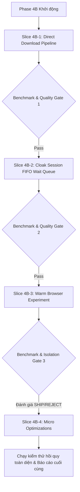

# Kế hoạch Triển khai Phase 4B — Tối ưu hóa Hiệu năng Trình duyệt (Browser Performance Optimization)

> **Mục tiêu:** Tối ưu hóa hiệu năng (Latency ↓, Throughput ↑, Memory Spike ↓), giữ vững độ tin cậy của Phase 4A (Reliability >= Phase 4A), không rò rỉ tài nguyên, tuyệt đối không thay đổi hành vi giải mã CAPTCHA/Turnstile/Anti-bot và 87 C++ stealth patches.

---

## 🎯 1. Nguyên tắc cốt lõi & Giới hạn bất biến (Core Invariants)

1. **Phạm vi nghiêm ngặt:** Chỉ tối ưu hóa vòng đời, bộ nhớ, I/O và hàng đợi. Không can thiệp vào:
   - Logic Turnstile / CAPTCHA solver
   - 87 C++ stealth patches
   - Chính sách lựa chọn tài khoản Spigot
   - Ngữ nghĩa xác thực tài khoản & cookies
2. **Không triển khai dồn dập:** Triển khai tuần tự theo 4 lát cắt (slices). Sau mỗi lát cắt phải chạy benchmark đo lường và vượt qua 100% Quality Gates (`vitest`, `tsc`, `build`, `git diff --check`).
3. **Chính sách từ chối (Failure Policy):** Nếu một cải tiến làm giảm độ trễ nhưng gây sụt giảm tỷ lệ thành công, tăng tỷ lệ sập, rò rỉ tài nguyên hoặc làm sai lệch mã băm SHA256 của tệp tải về -> **BÁC BỎ (REJECT)** và quay lại giải pháp ổn định trước đó.

---

## 📋 2. Lộ trình thực hiện 4 Lát cắt (Sequential Slices)

---

### 🚀 Lát cắt 4B-1: Đường ống Tải xuống Nhị phân Trực tiếp (Direct Download Pipeline)

- **Mục tiêu:** Triệt tiêu hoàn toàn Memory Spike (đang ngốn gấp 4.5x - 5x dung lượng tệp do Base64 IPC) và tăng throughput tải tệp.
- **Tệp chỉnh sửa:**
  - `discord/src/services/upstream/download-via-browser.ts`
  - `discord/tests/browser-reliability-hardening.test.ts` (thêm test cases tải trực tiếp & toàn vẹn dữ liệu)
- **Thiết kế chi tiết:**
  1. Trong `downloadResourceViaBrowser`:
     - Ưu tiên đường dẫn Native Browser Download qua CDP:
       - Đặt thư mục đích bằng `Page.setDownloadBehavior` và `Browser.setDownloadBehavior` trỏ thẳng vào thư mục tạm của phiên làm việc.
       - Kích hoạt sự kiện tải xuống, ghi trực tiếp luồng nhị phân vào tệp đĩa tạm `spigot-<uuid>.jar.part` mà không thông qua chuỗi Base64 hay JSON string IPC.
     - Cơ chế dự phòng an toàn (Fallback): Nếu đường dẫn Native Download gặp lỗi hoặc timeout không nhận được sự kiện, tự động chuyển về đường dẫn `fetch` có kiểm soát, bảo tồn 100% khả năng tải trong mọi tình huống.
  2. Xác minh tính toàn vẹn (Integrity Check):
     - Kiểm tra kích thước byte tối thiểu (`MIN_PLAUSIBLE_BYTES`).
     - Tính mã băm SHA256 ngay khi stream hoàn tất.
     - Thực hiện xuất bản nguyên tử (`atomic rename` từ `.part` sang `.jar`).
     - Bắt buộc xóa tệp tạm nếu gặp gián đoạn stream, lỗi hash hoặc timeout.
- **Bộ kiểm thử (Tests):**
  - Tải thành công các kích thước: 1MB, 10MB, 50MB, 100MB.
  - Ngắt stream giữa chừng -> tệp tạm bị xóa sạch, không xuất bản tệp hỏng.
  - Mã băm SHA256 khớp 100% với dữ liệu nguồn.
  - Timeout trong lúc stream -> giải phóng toàn bộ tài nguyên.

---

### ⏳ Lát cắt 4B-2: Hàng đợi Khóa phiên FIFO (Cloak Session FIFO Wait Queue)

- **Mục tiêu:** Loại bỏ lỗi `SessionConflictError` khi nhiều tác vụ đồng thời xảy ra, chuyển đổi cơ chế từ chối lập tức thành hàng đợi tuần tự công bằng (First-In, First-Out).
- **Tệp chỉnh sửa:**
  - `discord/src/services/upstream/cloak-session-manager.ts`
  - `discord/tests/browser-reliability-hardening.test.ts` (thêm test cases hàng đợi Q1..Q6)
- **Thiết kế chi tiết:**
  1. Cấu trúc hàng đợi `waitQueue: QueueWaiter[]`:
     - Mỗi waiter bao gồm `taskName`, `resolve`, `reject`, `timeoutTimer`, và `signal` (AbortSignal).
  2. Logic cấp phát khóa (`acquireLock`):
     - Nếu chưa có phiên hoạt động: cấp phát lock ngay lập tức (giữ nguyên Phase 4A).
     - Nếu đang có phiên hoạt động: đẩy vào hàng đợi chờ với `waitTimeoutMs` (mặc định 60,000ms).
  3. Logic giải phóng khóa (`release`):
     - Khi phiên hiện tại đóng, tự động lấy waiter tiếp theo ở đầu hàng đợi (`shift()`) để cấp lock.
  4. Quản lý vòng đời waiter an toàn:
     - Hủy chờ khi hết hạn (`TimeoutError`) -> xóa khỏi hàng đợi sạch sẽ, không rò rỉ timer.
     - Hủy chờ khi caller hủy (`AbortSignal`) -> loại bỏ waiter.
     - Phương thức `drainQueue(reason)`: khi shutdown hệ thống, từ chối toàn bộ waiters an toàn mà không bỏ sót pending promise.
- **Bộ kiểm thử (Tests):**
  - **Q1:** 2 tác vụ đồng thời -> tác vụ 1 chạy trước, tác vụ 2 chờ và chạy sau, không ném `SessionConflictError`.
  - **Q2:** 8 tác vụ đồng thời -> phục vụ chính xác theo thứ tự FIFO.
  - **Q3:** Hết thời gian chờ (Timeout) -> waiter bị reject sạch sẽ, hàng đợi không còn rác.
  - **Q4:** Caller hủy bỏ qua AbortSignal -> waiter được gỡ bỏ ngay lập tức.
  - **Q5:** Shutdown hệ thống khi đang có waiters -> tất cả được reject an toàn.
  - **Q6:** Trình duyệt của tác vụ trước bị crash -> tác vụ tiếp theo trong queue vẫn nhận lock bình thường.

---

### 🧪 Lát cắt 4B-3: Thử nghiệm Warm Browser (Warm Browser Experiment)

- **Mục tiêu:** Đánh giá tính khả thi và an toàn của việc giữ tiến trình Chromium nền để tiết kiệm ~700ms chi phí khởi tạo, kèm điều kiện cách ly tuyệt đối giữa các tài khoản.
- **Tệp chỉnh sửa:**
  - `discord/src/services/upstream/browser-launcher.ts`
  - `discord/src/services/upstream/cloak-session-manager.ts`
- **Thiết kế chi tiết:**
  1. Điều khiển qua biến môi trường: `WARM_BROWSER_EXPERIMENT=true` (Mặc định `false` = Cold Browser-per-job như Phase 4A).
  2. Nguyên tắc cách ly nghiêm ngặt (Isolation Principle):
     - Tuyệt đối **KHÔNG** chia sẻ phiên xác thực giữa Account A và Account B.
     - Sử dụng Browser Context độc lập (`createBrowserContext`) cho mỗi phiên nếu CloakBrowser hỗ trợ; hoặc thực hiện tẩy trùng toàn bộ dữ liệu phiên qua CDP (`Network.clearBrowserCookies`, `Storage.clearDataForOrigin`) trước khi bàn giao cho tài khoản mới.
     - Nếu phát hiện bất kỳ dấu hiệu rò rỉ cookie hoặc trạng thái Cloudflare giữa 2 tài khoản -> **BÁC BỎ (REJECT)** tính năng Warm Browser trên Production và chỉ giữ Cold Ephemeral Session.
- **Bộ kiểm thử (Tests):**
  - **W1:** Account A chạy -> dọn dẹp -> Account B chạy -> verify 0% rò rỉ cookie/storage.
  - **W2:** Account A đăng nhập -> Account B bắt đầu -> Account B không thấy marker phiên của A.
  - **W3:** Warm browser bị crash tiến trình -> tự động phát hiện, hủy handle cũ, tạo lại browser mới an toàn.
  - **W4:** 20 tác vụ tuần tự -> không tăng tiến trình, không phình RAM.
  - **W5:** Tắt flag (`WARM_BROWSER_EXPERIMENT=false`) -> hệ thống chạy chuẩn xác 100% theo cơ chế Cold của Phase 4A.

---

### ⚡ Lát cắt 4B-4: Tối ưu hóa Vi mô (Micro Optimizations)

- **Mục tiêu:** Loại bỏ các lãng phí CPU/IO nhỏ và chuẩn hóa phân cấp thời gian chờ.
- **Nội dung thực hiện:**
  1. **Memoize `resolveChromePath`:**
     - Lưu đệm đường dẫn binary Chrome sau lần kiểm tra đầu tiên trong `browser-launcher.ts`, tự động kiểm tra lại nếu tệp bị xóa.
  2. **Phân cấp Thời gian chờ (Hierarchical Deadlines):**
     - Thiết lập ma trận thời gian chờ trong `scheduler.ts`:
       - *Overall Job Deadline:* 120s - 180s (Thời gian tối đa toàn bộ công việc).
       - *Navigation Deadline:* 30s (Thời gian tải trang và xử lý Turnstile).
       - *Download Deadline:* 45s (Thời gian nhận luồng nhị phân).
  3. **Progress Heartbeat:**
     - Duy trì và đồng bộ cơ chế heartbeat của Phase 4A trong suốt quá trình streaming dữ liệu để tránh Watchdog báo động giả.

---

## 📊 3. Tiêu chí Đánh giá & Cổng Chất lượng (Quality & Benchmark Gates)

Mỗi lát cắt phải vượt qua:
1. `pnpm -r test`: Toàn bộ 963 bài kiểm thử cũ + các bài kiểm thử mới **100% PASS**.
2. `pnpm -r exec tsc --noEmit`: **0 lỗi kiểu dữ liệu**.
3. `pnpm -r build`: Build thành công trọn gói `dashboard` và `discord`.
4. `git diff --check`: **0 lỗi khoảng trắng**.
5. Đo lường hiệu năng 20 runs trước và sau:
   - P50, P95, P99 độ trễ
   - Đỉnh bộ nhớ RAM (Peak RSS)
   - Tỷ lệ thành công (Success rate >= 99%)
   - Tỷ lệ sập (Crash rate <= baseline)
   - Zero rò rỉ tài nguyên.
