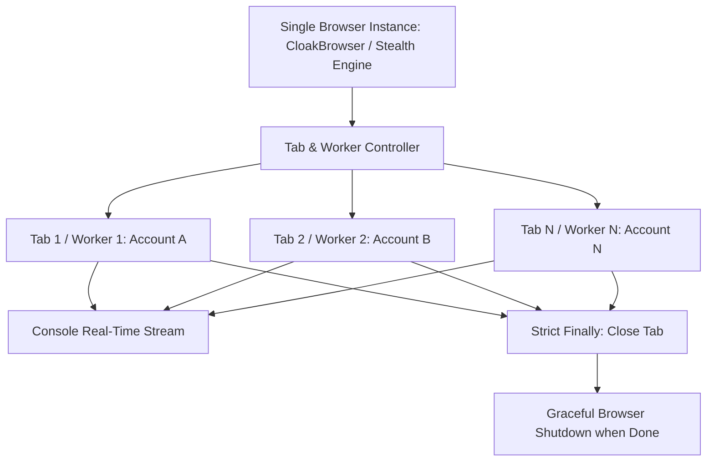

# Kế Hoạch Chiến Lược: 1 Browser Đa Tabs, Quản Lý Nút Bấm Nghiêm Ngặt, SQLite Mã Hóa & Tái Thiết Kế UI/UX Dashboard Flat Minimalist

> **Mã kế hoạch**: `PLAN-Single-Browser-Multi-Tabs-SQLite-Strict-Buttons-UI-UX-Pro-Max-00h51m36s-25-09-2026`  
> **Thời gian tạo**: 00:51:36 ngày 25/09/2026  
> **Tác nhân điều phối**: EZStore (Antigravity Orchestrator)  
> **Mục tiêu**: Xây dựng kiến trúc 1 Browser duy nhất mở và quản lý nhiều Tabs độc lập (mỗi tab 1 worker), phân định và kiểm soát chức năng nút bấm nghiêm ngặt, chuyển đổi lưu trữ tài khoản Spigot vào SQLite với mã hóa AES-256-GCM, và cải tổ toàn diện UI/UX Dashboard theo tiêu chuẩn Cool Blue Ocean Flat Minimalist (không gradient, không shadow, viền hairline 1px, pill buttons, data-dense).

---

## 🟢 PHASE 1: Discovery & Terrain Analysis (Khảo sát hiện trạng)

### 1.1 Hiện trạng hệ thống
1. **Quản lý Trình duyệt & Tải Spigot**:
   - Trước đây dự án dùng cơ chế đơn luồng tuần tự sau khi gỡ multi-instances.
   - Khi chạy tải hoặc quét, chỉ có 1 trang hoạt động. Người dùng yêu cầu: **Giữ 1 Browser duy nhất (CloakBrowser) nhưng cho phép mở cùng lúc nhiều Tabs**, mỗi tab được phân công cho **1 Worker độc lập** để tối ưu thời gian tải mà không bị phình RAM do mở nhiều tiến trình browser.
   - Các Tab phải được quản lý vòng đời nghiêm ngặt: tạo mới (`browser.newPage()`), theo dõi trạng thái, timeout độc lập, bắt buộc đóng (`page.close()`) trong `finally` block để chống rò rỉ bộ nhớ.
2. **Quy trình kích hoạt nút bấm trên Dashboard**:
   - Các nút hiện tại (`Run Scan Now`, `Run Download Now`, `Run All Now`) ở backend đang bị gộp chung luồng hoặc kích hoạt tải ngoài ý muốn khi người dùng chỉ muốn quét danh sách tài nguyên đã mua.
   - Người dùng yêu cầu quy chế nghiêm ngặt:
     - **Nút "Quét Tài Khoản Ngay (Run Scan Now)"**: CHỈ đăng nhập vào các tài khoản Spigot, cào danh sách plugin đã mua (`/resources/purchased`), cập nhật bảng liên kết `resource_ownership`. **TUYỆT ĐỐI KHÔNG TẢI BẤT KỲ FILE NÀO**.
     - **Nút "Tải Plugin Ngay (Run Download Now)"**: CHỈ quét hàng đợi tải và CHỈ tải các plugin **ĐÃ ĐƯỢC LIÊN KẾT** với tài khoản trong `resource_ownership`. Nếu plugin chưa gắn với tài khoản nào -> bỏ qua / cảnh báo, không tải mò.
     - **Nút "Tự Động Gắn ID & Tải Hết"**: Quy trình 3 bước rõ ràng: (1) Tra cứu Spiget gắn ID -> (2) Quét xác nhận liên kết tài khoản sở hữu -> (3) Tải các plugin đã xác thực quyền sở hữu.
3. **Lưu trữ & Bảo mật Tài khoản Spigot**:
   - Hiện tại lưu ở `data/spigot-credentials.json` và `data/spigot-accounts.json` (dạng plain JSON trên đĩa).
   - Yêu cầu: Chuyển toàn bộ sang lưu trữ trong **SQLite (`data/vault.db`)** tại bảng `spigot_accounts`.
   - Mật khẩu đăng nhập và các cookie nhạy cảm (`xf_user`, `xf_session`) phải được **mã hóa nghiêm ngặt bằng AES-256-GCM** với khóa dẫn xuất bảo mật từ `SESSION_SECRET` (sử dụng Salt và PBKDF2/Scrypt).
4. **Giao diện người dùng (UI/UX)**:
   - Dashboard hiện tại còn tàn dư CSS của "Giám Sát Trình Duyệt Song Song", nhiều hiệu ứng gradient bóng bẩy, bóng đổ (box-shadow) phức tạp chưa đồng nhất.
   - Cần đại tu theo đúng Spec: **Cool Blue Ocean Palette, Flat Minimalist, No Gradients, No Shadows, Viền Hairline 1px, Pill Buttons, Data-Dense Grid, Tối ưu Responsive Đa Thiết Bị**.

---

## 🟡 PHASE 2: Strategic Implementation Plan (Kế hoạch thực thi chiến lược)

### 2.1 Kiến trúc Cơ sở dữ liệu: SQLite & Mã hóa AES-256-GCM (`/database-design`)

#### A. Thiết kế Bảng `spigot_accounts` (STRICT mode)
```sql
CREATE TABLE IF NOT EXISTS spigot_accounts (
  id                   INTEGER PRIMARY KEY AUTOINCREMENT,
  label                TEXT    NOT NULL UNIQUE,
  username             TEXT    NOT NULL,
  -- AES-256-GCM payload format: hex(iv):hex(authTag):hex(ciphertext)
  password_encrypted   TEXT    NOT NULL,
  xf_user_encrypted    TEXT    NOT NULL DEFAULT '',
  xf_session_encrypted TEXT    NOT NULL DEFAULT '',
  issued_at            TEXT,
  last_verified_at     TEXT,
  status               TEXT    NOT NULL DEFAULT 'ok'
                         CHECK (status IN ('ok', 'stale', 'needs_login', 'locked')),
  is_enabled           INTEGER NOT NULL DEFAULT 1 CHECK (is_enabled IN (0, 1)),
  created_at           INTEGER NOT NULL,
  updated_at           INTEGER NOT NULL
) STRICT;

CREATE INDEX IF NOT EXISTS idx_spigot_accounts_status  ON spigot_accounts (status);
CREATE INDEX IF NOT EXISTS idx_spigot_accounts_enabled ON spigot_accounts (is_enabled);
```

#### B. Module Mã Hóa An Toàn (`src/utils/crypto-vault.ts`)
- **Thuật toán**: `aes-256-gcm` chuẩn doanh nghiệp.
- **Dẫn xuất khóa (Key Derivation)**: Sử dụng `crypto.scryptSync(env.SESSION_SECRET, salt, 32)` với salt tĩnh của hệ thống và IV ngẫu nhiên 12-byte cho mỗi lần mã hóa.
- **Cấu trúc lưu trữ chuỗi**: `iv:tag:ciphertext` (mã hóa hex).
- Cung cấp các hàm:
  - `encryptField(plaintext: string): string`
  - `decryptField(encryptedPayload: string): string`
- Đảm bảo khi trả ra API hoặc log console, mật khẩu và cookie luôn được chuyển thành `Secret` object hoặc che dấu `[redacted]`.

#### C. Quy trình Tự Động Di Trú (Migration & Auto-import)
- Khi máy chủ khởi động:
  - Kiểm tra bảng `spigot_accounts`.
  - Nếu bảng chưa có bản ghi nhưng tệp `spigot-credentials.json` hoặc `spigot-accounts.json` tồn tại:
    - Đọc dữ liệu, mã hóa toàn bộ mật khẩu và cookie phiên.
    - Chèn vào SQLite `spigot_accounts`.
    - Đổi tên tệp cũ thành `.backup` để bảo mật.

---

### 2.2 Kiến trúc Single Browser Multi-Tabs Engine (`/playwright-skill` & CloakBrowser)



#### A. Nguyên lý Hoạt động
1. **Một Browser Duy Nhất (Single Process)**:
   - Hệ thống chỉ mở duy nhất **1 tiến trình CloakBrowser** (Stealth Chromium).
   - Tối đa hoá việc tiết kiệm tài nguyên RAM và CPU trên VPS.
2. **Nhiều Tabs Song Song Với Quản Lý Nghiêm Ngặt**:
   - Sử dụng `browser.newPage()` để cấp phát Tab riêng cho từng Worker.
   - Số lượng Tab hoạt động đồng thời được kiểm soát qua giới hạn trần (ví dụ: `concurrency: 2` hoặc `3` tabs) để không bị nghẽn CPU và tránh bị Cloudflare cấm IP hàng loạt.
   - Mỗi Tab có ngữ cảnh thực thi độc lập:
     - Worker ID rõ ràng (`Worker #1`, `Worker #2`).
     - Đặt Timeout cho từng thao tác trên tab (60s tối đa cho mỗi tác vụ trang).
     - Bọc toàn bộ trong `try ... finally { await page.close(); }` đảm bảo dù thành công hay lỗi thì tab vẫn được giải phóng ngay lập tức.
3. **Phân lập lỗi (Error Isolation)**:
   - Nếu Tab 1 gặp Cloudflare Challenge hoặc lỗi mạng, hệ thống chỉ đóng Tab 1, ghi log cảnh báo và đưa tài khoản đó vào trạng thái chờ (cooldown). Các Tab khác vẫn tiếp tục làm việc bình thường, không làm sập Browser.
4. **Console Log Real-time**:
   - Giữ nguyên cửa sổ Console Log trong trang Dashboard với tiền tố rõ ràng theo từng Worker/Tab:
     `[Tab #1] [acc-1] Đang xác thực Cloudflare...`
     `[Tab #2] [acc-2] Đang tải plugin Vulcan 2.9.8...`

---

### 2.3 Phân Định Rõ Ràng & Nghiêm Ngặt Các Chức Năng Nút Bấm (`/api`)

| Nút Bấm | Endpoint API | Hành Vi Nghiêm Ngặt | Điều Kiện Chặn |
| :--- | :--- | :--- | :--- |
| **🔍 Quét Tài Khoản Ngay (Run Scan Now)** | `POST /api/spigot-accounts/scan-now` | **CHỈ QUÉT VÀ LIÊN KẾT**. Mở Tab cào trang `/resources/purchased` của các tài khoản Spigot, ghi nhận vào bảng `resource_ownership` (`state = 'owned'`). Sau khi quét xong thì dừng lại và báo cáo số lượng plugin liên kết. | **TUYỆT ĐỐI KHÔNG TẢI FILE JAR NÀO**. |
| **🚀 Tải Plugin Ngay (Run Download Now)** | `POST /api/spigot-downloads/run-download-now` | **CHỈ TẢI PLUGIN ĐÃ LIÊN KẾT**. Quét danh sách plugin trong kho, đối chiếu với `resource_ownership`. Chỉ tải các plugin mà tài khoản có quyền sở hữu. | **TỪ CHỐI TẢI** các plugin chưa được liên kết với bất kỳ tài khoản nào. Thông báo rõ plugin nào chưa gắn ID / chưa có tài khoản sở hữu. |
| **⚡ Tự Động Gắn ID & Tải Hết** | `POST /api/spigot-downloads/run-all` | **QUY TRÌNH 3 BƯỚC KHÉP KÍN**: <br>1. Tra cứu Spiget API để gắn `resource_id` cho các plugin chưa có ID.<br>2. Kích hoạt quét tài khoản để cập nhật quyền sở hữu (`resource_ownership`).<br>3. Chỉ tải những plugin đã xác nhận có quyền sở hữu hợp lệ. | Bỏ qua các plugin không tìm thấy trên Spiget hoặc không có tài khoản nào sở hữu. |
| **🛑 Dừng Khẩn Cấp** | `POST /api/spigot-downloads/stop` | Đóng toàn bộ các Tabs đang chạy, giải phóng Worker và đóng sạch Browser instance. | Lập tức ngắt toàn bộ tiến trình tải/quét. |

---

### 2.4 Tái Thiết Kế Giao Diện UI/UX Dashboard (`/ui-ux-pro-max`)

Áp dụng tuyệt đối định hướng thiết kế **Cool Blue Ocean Flat Minimalist**:

```
Overall Style: Clean minimalist design, lots of whitespace, restrained monochrome palette, one accent color.
Surface & Borders: Flat design, solid colors, simple geometric shapes, NO GRADIENTS, NO SHADOWS.
Cards: Outlined cards with hairline 1px borders (#e2e8f0 cho light mode, #1e293b cho dark mode), no shadow.
Theme: 
  - Light mode: White surfaces (#ffffff), subtle light grey background (#f8fafc), soft grey borders.
  - Dark mode: True dark mode, near-black surfaces (#090d16 / #0f172a), high-contrast crisp text.
Color Palette: Cool Blue Ocean Palette:
  - Primary Accent: #0284c7 (Ocean Blue) / #0ea5e9 (Sky Blue)
  - Secondary Accent: #0369a1 (Deep Ocean)
  - Success: #059669 (Emerald Flat)
  - Warning: #d97706 (Amber Flat)
  - Danger: #dc2626 (Rose Flat)
Buttons: Pill-shaped buttons with full corner radius (border-radius: 9999px), flat solid colors, no gradients, no heavy glow.
Inputs/Cards: Subtle corner radius 6px to 8px, hairline 1px border.
Motion: Subtle micro-interactions on hover and click; cards lift slightly (translateY(-2px)); 200ms ease transitions; smooth page transitions without jarring reloads.
Spacing: Compact data-dense spacing, minimal padding, maximum readable information.
Components to Purge: Loại bỏ hoàn toàn khối CSS và tàn dư của "Giám Sát Trình Duyệt Song Song".
```

---

## 🔵 PHASE 3: Surgical Task Distribution (Bóc tách công việc chi tiết)

```
[ ] TASK-01: [Database] Tạo bảng spigot_accounts trong SQLite & Module mã hóa AES-256-GCM (src/utils/crypto-vault.ts)
[ ] TASK-02: [Database] Viết Repository spigot-accounts.ts với đầy đủ CRUD và tự động migration từ json cũ
[ ] TASK-03: [Engine] Tái cấu trúc browser-launcher.ts & scheduler.ts: 1 Browser duy nhất mở và quản lý nhiều Tabs song song
[ ] TASK-04: [Backend] Cập nhật các Route API: Tách biệt triệt để logic Quét (Scan-only) và Tải (Strict Download)
[ ] TASK-05: [Backend] Áp dụng ràng buộc nghiêm ngặt: Nút "Tải Plugin Ngay" chỉ cho phép tải plugin đã liên kết sở hữu
[ ] TASK-06: [Frontend] Dọn sạch toàn bộ CSS thừa của "Giám Sát Trình Duyệt Song Song" trong styles.css
[ ] TASK-07: [Frontend] Tái thiết kế toàn bộ hệ thống CSS & Theme: Cool Blue Ocean, Flat Design, No Gradient, No Shadow, Hairline Borders
[ ] TASK-08: [Frontend] Thiết kế lại spigot-accounts-page.tsx: Pill-shaped action buttons, dense data tables, responsive layouts
[ ] TASK-09: [Frontend] Tối ưu hóa giao diện đa phương tiện (Mobile, Tablet, Desktop) và kiểm tra Console log real-time
[ ] TASK-10: [QA & E2E] Viết test kiểm thử mã hóa DB, unit test logic nút bấm và kiểm tra toàn diện Vitest + TSC
```

---

## 🔴 PHASE 4: Plan Validation & Verification Plan (Kế hoạch kiểm thử & nghiệm thu)

### 4.1 Kiểm Thử Tự Động (Automated Testing)
1. **Kiểm tra biên dịch Type**:
   - Chạy `npx tsc --noEmit` để đảm bảo 0 lỗi TypeScript trên cả server và dashboard.
2. **Kiểm tra Cơ sở dữ liệu & Mã hóa**:
   - Viết unit test cho `src/utils/crypto-vault.ts`: Kiểm tra mã hóa và giải mã chính xác mật khẩu/cookie, đảm bảo dữ liệu trong SQLite không ở dạng plain text.
   - Kiểm tra migration: Tự động nạp tài khoản từ json cũ vào SQLite thành công.
3. **Kiểm tra Logic Nút Bấm & Worker Tabs**:
   - Test `runScanNow`: Đảm bảo chỉ cào ownership, không gọi hàm download jar.
   - Test `runDownloadNow`: Đảm bảo chỉ tải plugin có trong `resource_ownership`, bỏ qua plugin chưa liên kết.
   - Test Multi-Tabs: 1 browser mở 2 tabs đồng thời, đóng sạch sau khi xong mà không rò rỉ session.
4. **Kiểm tra Frontend Build**:
   - Chạy `npm run build` và `npm run dashboard:build` đảm bảo bundle thành công.

### 4.2 Kiểm Thử Thủ Công & Trực Quan (Manual Verification)
1. Mở Dashboard trên trình duyệt:
   - Kiểm tra phong cách hiển thị: Nền phẳng, viền 1px mảnh (hairline), không bóng đổ, không gradient rực rỡ, nút bấm bo tròn dạng pill (`rounded-full`).
   - Kiểm tra Dark mode & Light mode chuyển đổi mượt mà.
   - Thử nghiệm co giãn màn hình (Mobile 375px, Tablet 768px, Desktop 1440px) đảm bảo responsive hoàn hảo.
2. Bấm thử nút **"🔍 Quét Tài Khoản Ngay"**:
   - Quan sát Console log: Chỉ quét và báo danh sách plugin đã liên kết, kho plugin không phát sinh lượt tải file jar mới.
3. Bấm thử nút **"🚀 Tải Plugin Ngay"**:
   - Xác nhận hệ thống chỉ tải các plugin đã sở hữu.

---

[OK] Plan Created: file:///e:/Codebase/kho-plugin/plans/PLAN-Single-Browser-Multi-Tabs-SQLite-Strict-Buttons-UI-UX-Pro-Max-00h51m36s-25-09-2026.md
