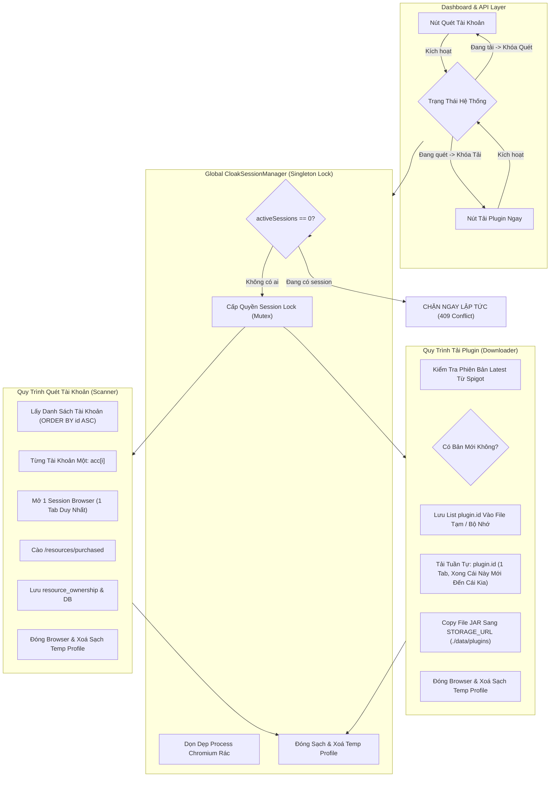

# KẾ HOẠCH HÀNH ĐỘNG: SIẾT CHẶT 1 CLOAKBROWSER SESSION DUY NHẤT, 1 TAB TUẦN TỰ, QUY TRÌNH QUÉT & TẢI THEO INTERNAL PLUGIN.ID, STORAGE_URL & XOÁ DẤU VẾT ẨN DANH

> **Tệp Kế Hoạch**: `plans/PLAN-Strict-Single-Browser-Single-Tab-Sequential-Pipeline-03h47m00s-25-09-2026.md`  
> **Thời Gian Khởi Tạo**: 03h47m00s - 25/09/2026  
> **Danh Tính Agent**: EZStore (Pair Programming Specialist)  
> **Áp Dụng Kỹ Năng**: `/database-design`, `/typescript-pro`, `/plan-writing`, `/writing-plans`, `/plan`

---

## 🎯 1. BỐI CẢNH & PHÂN TÍCH NGUYÊN NHÂN GỐC RỄ (ROOT CAUSE)

### 1.1. Lỗi CloakBrowser Pro Session Limit Reached
- **Thông báo lỗi**:
  ```text
  CloakBrowser Pro: session limit reached for your plan. Close another running session or upgrade your plan.
  ```
- **Nguyên nhân**:
  1. Gói CloakBrowser Pro của người dùng giới hạn **duy nhất 1 phiên chạy đồng thời (1 concurrent session)**.
  2. Kiến trúc trước đây chưa có cơ chế Singleton Session Mutex toàn cục (Global Mutex Lock) để khóa cứng tiến trình. Khi một phiên cũ đóng chưa dứt điểm (chưa giải phóng kết nối WebSocket / CDP hoặc process Chromium chưa thoát hẳn), hoặc các tác vụ background sweep / scan / manual download kích hoạt gối đầu nhau, CloakBrowser server phát hiện có 2 session cùng lúc và ngay lập tức chặn đứng toàn bộ tiến trình.
  3. Logic Multi-Tab mở nhiều tab con (`browser.newPage()`) làm phức tạp hoá vòng đời kết nối, dễ gây nghẽn kết nối và không tương thích với yêu cầu ẩn danh dọn sạch dấu vết từng tác vụ.

### 1.2. Yêu Cầu Cốt Lõi Từ Người Dùng
1. **Kiểm soát Session CloakBrowser tuyệt đối**:
   - Luôn kiểm tra session CloakBrowser. Tuyệt đối không cho phép mở phiên thứ 2; nếu phát hiện nguy cơ mở nhiều hơn 1 session thì **ngăn chặn ngay lập tức**.
2. **Bỏ hoàn toàn Multi-Tab — Chỉ dùng 1 Tab duy nhất**:
   - Mỗi phiên Browser chỉ có đúng 1 tab (`session.page`). Mỗi lần chỉ thực hiện tải 1 plugin hoặc quét 1 tài khoản.
3. **Quy trình "Quét Plugins" (Scanner) Tuần Tự & Xoá Dấu Vết**:
   - Tài khoản được lưu trong SQLite `spigot_accounts`, có thứ tự nhất định (`ORDER BY id ASC`).
   - Quét tuần tự từng tài khoản một, không tự ý nhảy cóc, phá vỡ quy trình.
   - Mỗi tài khoản chạy trên 1 session Browser ẩn danh mới. Sau khi quét xong tài khoản đó thì **đóng session và xóa sạch mọi dấu vết (profile tạm, cache, cookies)** để bảo vệ danh tính tuyệt đối.
4. **Quy trình "Tải Plugins" (Downloader) Theo Internal `plugin.id`**:
   - Các plugin đã liên kết với tài khoản sở hữu có `id` riêng trong database (Database Internal Plugin ID, khác với Spiget Resource ID).
   - Kiểm tra tuần tự từng plugin xem phiên bản trong DB đã là Latest chưa:
     - Nếu có phiên bản mới: Lưu `plugin.id` vào danh sách/file tạm.
     - Kiểm tra xem có session Browser nào đang mở không:
       - Nếu có: Dùng chính session đó (tab duy nhất) để tải theo thứ tự sắp xếp trong DB. Tải xong `plugin.id` này mới bắt đầu `plugin.id` tiếp theo, tuyệt đối không chồng chéo. Xong toàn bộ thì đóng và xoá sạch dấu vết.
       - Nếu chưa có: Mở Browser mới (1 tab duy nhất), tải tuần tự từng plugin, xong thì đóng và xoá sạch dấu vết.
     - Nếu không có phiên bản mới: Kết thúc phiên chạy ngay.
5. **Khóa Loại Trừ Lẫn Nhau (Mutual Exclusion)**:
   - Khi chạy "Tải Plugins", chức năng "Quét Plugins" sẽ BỊ VÔ HIỆU HÓA.
   - Khi chạy "Quét Plugins", chức năng "Tải Plugins" sẽ BỊ VÔ HIỆU HÓA.
6. **Thư Mục Lưu Trữ Plugins Đã Tải (`STORAGE_URL`)**:
   - Cấu hình qua `.env`: `STORAGE_URL=./data/plugins`.
   - File JAR khi tải về sẽ được tự động lưu/copy vào thư mục này để Chủ sở hữu có thể lấy ra nhanh chóng, không phụ thuộc vào Browser profile (vốn sẽ bị xoá sạch sau mỗi phiên).
7. **Dọn dẹp mã nguồn & files dư thừa**:
   - Xóa bỏ `data/spigot-credentials.json` (vì đã chuyển hoàn toàn sang SQLite).
   - Xóa các hàm/type liên quan đến multi-tab và instance tracker cũ không còn sử dụng.

---

## 🏛️ 2. THIẾT KẾ KIẾN TRÚC MỚI (ARCHITECTURAL BLUEPRINT)



---

## 📋 3. LỘ TRÌNH TRIỂN KHAI CHI TIẾT (PHASE-BY-PHASE TASKS)

### 🔹 Giai đoạn 1: Xây Dựng Singleton `CloakSessionManager` & Ngăn Chặn Đa Phiên
- [ ] **Tạo file mới**: `src/services/upstream/cloak-session-manager.ts`
  - Quản lý trạng thái duy nhất: `activeSession: { taskName: string; browser: any; startedAt: number; tempProfileDir?: string } | null`.
  - Hàm `hasActiveSession(): boolean`.
  - Hàm `acquireLock(taskName: string): Promise<SessionLockHandle>`:
    - Nếu đã có session đang chạy: Ném lỗi `SessionConflictError` hoặc từ chối ngay lập tức với thông điệp: `"Đã có 1 phiên CloakBrowser đang chạy (${taskName}). Ngăn chặn mở thêm để tuân thủ giới hạn gói 1 session duy nhất."`
  - Hàm `forceCleanupOrphanProcesses()`: Sử dụng lệnh hệ thống để quét và tiêu diệt các tiến trình Chromium mồ côi (nếu có) trước khi mở phiên mới.
  - Hàm `releaseLock()`: Đảm bảo đóng `browser.close()`, kill SIGKILL nếu quá 5s, và xóa sạch thư mục `tempProfileDir`.
- [ ] **Cập nhật `browser-launcher.ts`**:
  - Tích hợp chặt chẽ với `CloakSessionManager`.
  - Loại bỏ hoàn toàn `createTab` và `closeTab`. Trả về `BrowserSession` chỉ có `page: Page`, không còn multi-tab APIs.
- [ ] **Viết unit test**: `tests/cloak-session-manager.test.ts` kiểm chứng việc từ chối phiên thứ 2 và giải phóng lock an toàn.

---

### 🔹 Giai đoạn 2: Cấu Hình `STORAGE_URL` & Quản Lý File JAR Xuất Xưởng
- [ ] **Cập nhật `src/config/env.ts`**:
  - Bổ sung `STORAGE_URL: projectPath('./data/plugins')`.
  - Cập nhật `.env.example` và `.env` của người dùng:
    ```env
    # Thư mục lưu trữ plugin tải về để dễ dàng lấy file
    STORAGE_URL=./data/plugins
    ```
- [ ] **Tạo tiện ích lưu trữ**: `src/services/storage/export-plugin-file.ts`:
  - Khi một phiên bản plugin được tải về và lưu vào Vault (`VAULT_DIR`), tự động sao chép một bản vào thư mục `STORAGE_URL` với cấu trúc chuẩn:
    `{STORAGE_URL}/{plugin.id}/{display_name}-v{version}.jar`
    Ví dụ: `./data/plugins/12/Example-v1.1.0.jar`
  - Tự động tạo thư mục con `{STORAGE_URL}/{plugin.id}` nếu chưa tồn tại (`mkdirSync(dir, { recursive: true })`).
- [ ] **Tạo Script Dọn Sạch Toàn Bộ CSDL Cũ (`scripts/reset-all-data.ts`)**:
  - Hỗ trợ Chủ sở hữu reset hoàn toàn hệ thống để thử nghiệm mới từ đầu:
    - Xoá sạch database cũ `data/vault.db`, `data/vault.db-wal`, `data/vault.db-shm`.
    - Dọn sạch các thư mục tạm `tmp/`, cache chrome và `data/plugins/` cũ.
    - Chạy lại toàn bộ migrations để tái lập CSDL SQLite mới tinh 100%.
  - Thêm lệnh vào `package.json`: `"reset:all-data": "tsx scripts/reset-all-data.ts"`.

---

### 🔹 Giai đoạn 3: Tái Cấu Trúc Chức Năng "Quét Plugins" (Scanner) Tuần Tự & Ẩn Danh
- [ ] **Cập nhật logic Scanner trong `scheduler.ts`**:
  - Khóa hệ thống: Đặt `currentOperation = 'scanning'`.
  - Lấy danh sách tài khoản hợp lệ từ SQLite:
    `const accounts = listEnabledSpigotAccounts(deps.db); // Sắp xếp theo ORDER BY id ASC`
  - Lặp tuần tự qua từng tài khoản (Account 1 -> Account 2 -> Account 3...):
    1. Tạo thư mục profile tạm thời riêng biệt: `join(deps.env.TMP_DIR, 'ephemeral-scan-${acc.id}-${Date.now()}')`.
    2. Gọi `cloakSessionManager.acquireLock('scan-account-' + acc.label)`.
    3. Mở Browser (1 tab duy nhất) với profile tạm thời đó.
    4. Thực hiện đăng nhập, vượt Cloudflare (nếu cần), cào danh sách plugin đã mua từ `/resources/purchased`.
    5. Cập nhật quyền sở hữu vào bảng `resource_ownership` (`state = 'owned'`) và cập nhật cookies mới vào `spigot_accounts`.
    6. Đóng Browser session triệt để qua `cloakSessionManager.releaseLock()`.
    7. **Xóa sạch thư mục profile tạm thời** (`rmSync(tempDir, { recursive: true, force: true })`).
    8. Nghỉ một khoảng an toàn (cooldown) rồi mới chuyển sang tài khoản kế tiếp.
  - Sau khi quét xong toàn bộ tài khoản: Trả `currentOperation = 'idle'`.

---

### 🔹 Giai đoạn 4: Tái Cấu Trúc Chức Năng "Tải Plugins" (Downloader) Tuần Tự Theo Internal `plugin.id`
- [ ] **Cập nhật logic Downloader trong `scheduler.ts` & `auto-download-versions.ts`**:
  - Khóa hệ thống: Đặt `currentOperation = 'downloading'`.
  - **Bước 1 - Kiểm tra phiên bản Latest**:
    - Duyệt qua từng plugin trong database: Lấy phiên bản cao nhất hiện có trong bảng `versions` so sánh với phiên bản mới nhất từ Spigot (qua Spiget API).
    - Lọc ra danh sách các plugin cần tải:
      `{ pluginId: plugin.id, resourceId: plugin.resource_id, newVersion: string, assignedAccount: string }[]`.
  - **Bước 2 - Lưu danh sách vào bộ nhớ / file tạm**:
    - Lưu danh sách sắp xếp theo `plugin.id ASC` vào file tạm `tmp/download-queue-${Date.now()}.json` hoặc queue bộ nhớ.
    - Nếu danh sách rỗng (tất cả đã là Latest): Log thông báo `"Tất cả plugin đã là phiên bản mới nhất, kết thúc phiên chạy!"` -> Đặt `currentOperation = 'idle'` và dừng.
  - **Bước 3 - Tiến hành tải tuần tự (Single Tab, Single Browser)**:
    - Kiểm tra xem có session Browser nào đang mở không qua `cloakSessionManager.hasActiveSession()`.
    - Mở 1 session Browser duy nhất (1 tab duy nhất) với thư mục profile tạm thời.
    - Lần lượt tải từng plugin theo thứ tự `plugin.id`:
      - **Chỉ tải 1 plugin tại một thời điểm**.
      - Chờ xác nhận file JAR tải về hoàn tất 100% và đã được lưu vào Vault + copy vào `STORAGE_URL`.
      - Ghi nhận phiên bản mới vào bảng `versions`.
      - **Chỉ khi plugin này hoàn tất mới bắt đầu plugin tiếp theo**. Tuyệt đối không chồng chéo!
    - Sau khi hoàn thành toàn bộ danh sách:
      - Đóng Browser session triệt để.
      - Xóa sạch thư mục profile tạm thời để che giấu dấu vết.
  - Sau khi tải xong: Trả `currentOperation = 'idle'`.

---

### 🔹 Giai đoạn 5: Cơ Chế Khóa Loại Trừ Lẫn Nhau & Đồng Bộ Giao Diện Dashboard
- [ ] **Khóa API trong `src/http/routes/dashboard-api.ts`**:
  - Endpoint `/api/spigot-accounts/scan-now`:
    - Nếu `currentOperation === 'downloading'`: Trả về HTTP 409 Conflict: `{"ok": false, "error": "Hệ thống đang thực hiện Tải Plugins. Chức năng Quét tạm thời bị vô hiệu hoá."}`.
  - Endpoint `/api/spigot-downloads/run-download-now`:
    - Nếu `currentOperation === 'scanning'`: Trả về HTTP 409 Conflict: `{"ok": false, "error": "Hệ thống đang thực hiện Quét Tài Khoản. Chức năng Tải tạm thời bị vô hiệu hoá."}`.
  - Bổ sung trường `currentOperation: 'idle' | 'scanning' | 'downloading'` vào `/api/spigot-accounts/status` hoặc `/api/status`.
- [ ] **Giao diện Dashboard (`dashboard/src/pages/spigot-accounts-page.tsx`)**:
  - Khi `currentOperation === 'downloading'`: Nút "Quét Tài Khoản Ngay" hiển thị trạng thái Disabled kèm tooltip cảnh báo.
  - Khi `currentOperation === 'scanning'`: Nút "Tải Plugin Ngay" hiển thị trạng thái Disabled kèm tooltip cảnh báo.

---

### 🔹 Giai đoạn 6: Dọn Dẹp File Rác & Mã Nguồn Dư Thừa
- [ ] Xóa bỏ file `data/spigot-credentials.json` khỏi kho lưu trữ.
- [ ] Dọn dẹp các import / reference đến credentials file trong `scheduler.ts`, `env.ts`, `auto-download-versions.ts`.
- [ ] Cập nhật `.env.example` và `.env` tương thích hoàn toàn.
- [ ] Chạy toàn bộ test suite (`npm test`), `typecheck` và `dashboard:build` để xác nhận 100% đạt chuẩn chất lượng.

---

## 🔒 4. KẾ HOẠCH KIỂM THỬ (VERIFICATION & QUALITY GATES)

1. **Gate 1 - Mutex Concurrency Test**:
   - Thử nghiệm gọi 2 lần `acquireLock` liên tiếp -> Lần thứ 2 bắt buộc phải bị từ chối ngay lập tức, không gây ra lỗi `session limit reached`.
2. **Gate 2 - Single Tab Sequential Test**:
   - Kiểm tra mã nguồn không còn bất kỳ lệnh `newPage()` hoặc tạo tab con nào trong luồng worker.
   - Kiểm tra log tải plugin hiển thị rõ ràng thứ tự `plugin.id` tuần tự từng plugin một.
3. **Gate 3 - Ephemeral Wipe Verification**:
   - Sau khi hoàn thành quét tài khoản hoặc tải plugin, kiểm tra thư mục tạm đã bị xóa hoàn toàn khỏi ổ đĩa.
4. **Gate 4 - Mutual Exclusion Verification**:
   - Kích hoạt Scanner -> Gửi request Downloader -> API trả về HTTP 409 và từ chối.
   - Kích hoạt Downloader -> Gửi request Scanner -> API trả về HTTP 409 và từ chối.
5. **Gate 5 - Storage URL Verification**:
   - Tải thử 1 plugin -> File JAR xuất hiện đầy đủ trong thư mục cấu hình `STORAGE_URL` (`./data/plugins`).

---

*Kế hoạch này tuân thủ nghiêm ngặt các quy tắc hệ thống, sẵn sàng thực thi ngay sau khi nhận được sự đồng thuận từ bạn.*
